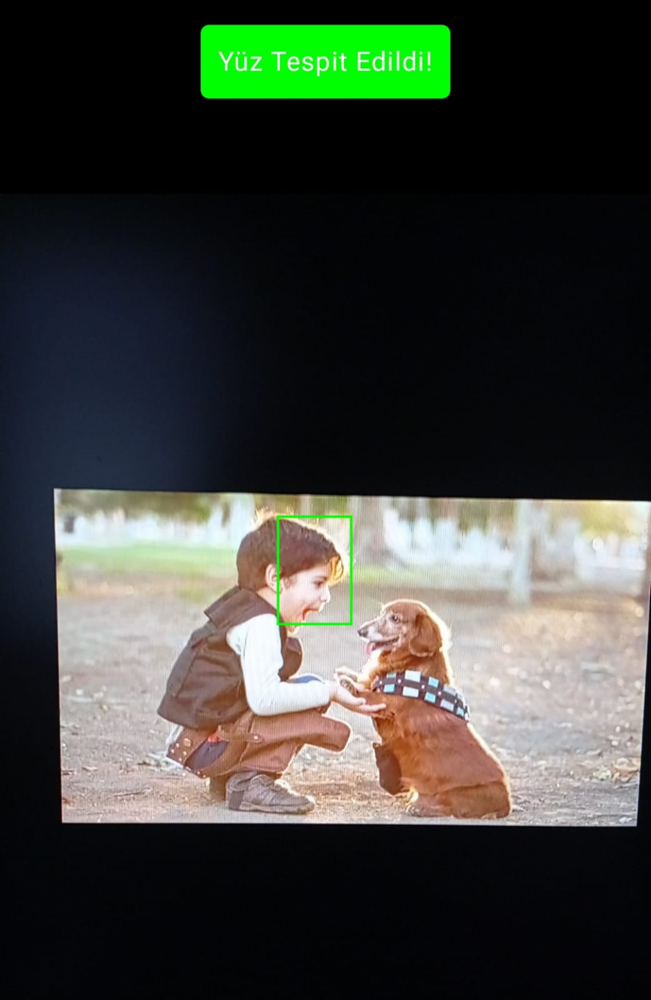
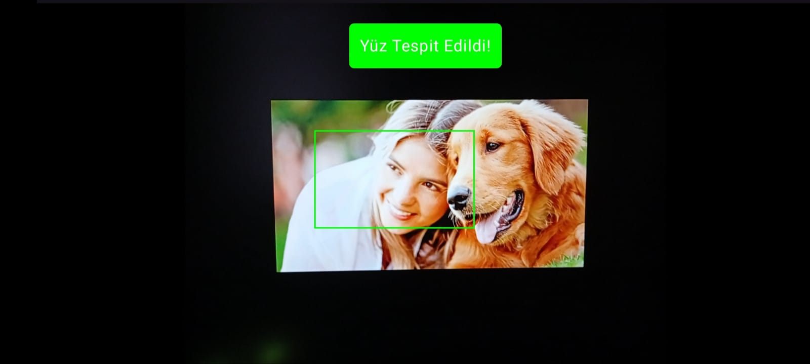

# Android Face Detection App using CameraX & ML Kit

This is a real-time face detection Android application built using **Jetpack Compose**, **CameraX**, and **Google ML Kit**.

> ✅ This app detects faces from the live camera feed and draws bounding boxes over them with high accuracy, even when the device orientation changes.

---

## 📸 Features

- Real-time face detection using **ML Kit**
- Accurate bounding box rendering using **Canvas**
- **Rotation-aware** face bounding box drawing
- Built with **Jetpack Compose** and **CameraX**
- Easy permission handling
- Fully responsive layout in portrait and landscape modes

---

## 🚀 Technologies Used

- Kotlin (Jetpack Compose)
- CameraX (Preview + ImageAnalysis)
- Google ML Kit – Face Detection
- AndroidX Lifecycle
- Material3 (Jetpack Compose)
- Canvas Drawing API

---

## 📱 Screenshots

| Portrait | Landscape                                                                              |
|---------|----------------------------------------------------------------------------------------|
|  |  |

---

## 🔧 How It Works

1. Camera feed is initialized with `PreviewView` using CameraX.
2. Each frame is analyzed with `ImageAnalysis` and sent to ML Kit's `FaceDetector`.
3. Detected `boundingBox` values are scaled and mapped proportionally to the `Canvas` using percentage-based transforms.
4. The app automatically handles device rotation (portrait/landscape) to ensure bounding boxes stay aligned.

---

## 🧑‍💻 Developed by

**Fatih Can Ata**  
[github.com/fcatadev](https://github.com/fcatadev)

---

## 📄 License

MIT License – free for personal or commercial use.
